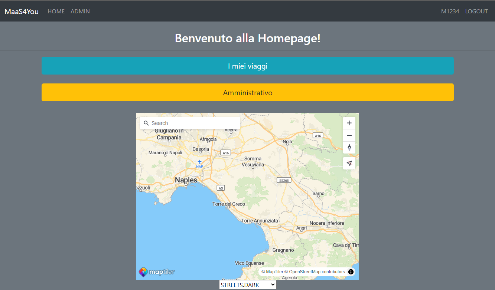

# Maas4You
 JAVA application to show a possible implementation of a management system for smart mobility following MaaS approach.
The application is a Client-Server witn an MVC for the architecture and a DTO for data transfer.

The following Use Case diagram shows users and implemented iteractions.

This application uses the following technologies:
1. JAVA SpringBoot Framework
2. Keycloak as IAM management system
3. HashiCorp Vault as secure credential storage system
4. NginX as secure connection filtering and load balancer
5. OpenSSL as self certificate issuer
6. Docker

Main page with interactive map:

Roles
