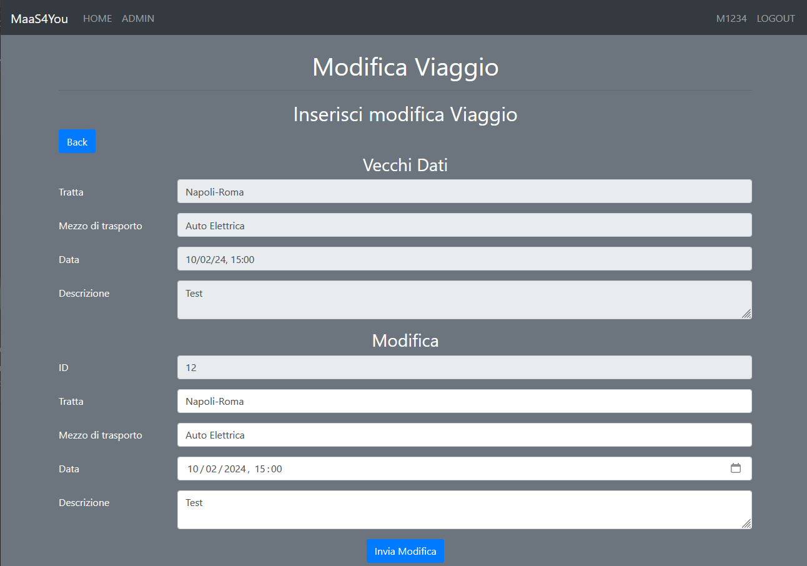

# Maas4You
JAVA application to show a possible implementation of a security layer for a management system for smart mobility following MaaS approach.
The application is a Client-Server witn an MVC for the architecture and a DTO for data transfer. Everything is containerized using Docker.

The following image describes the Use Case diagram for users and implemented iteractions.

This application uses the following technologies:
1. JAVA SpringBoot Framework
2. Keycloak as IAM management system
3. HashiCorp Vault as secure credential storage system
4. NginX as secure connection filtering and load balancer
5. OpenSSL as self certificate issuer
6. Docker

The following images describe the system model realized with [Microsoft Threat Modeling Tool]([https://kubesphere.io/docs/v3.4/installing-on-linux/introduction/multioverview/](https://learn.microsoft.com/en-us/azure/security/develop/threat-modeling-tool)) and the Deployment diagram of how the application is deployed with docker.

After the docker-compose has been completed, it is possible to execute the command `docker-compose up` to create the containers as follows:
1. All containers start except `maas4you` and `maas4you_proxy` because the application depends on the secret contained in Vault and the proxy depends on the application itself.
2. Visit the address https://localhost:9443/vault to unseal the vault with the three keys fragment and the token.
3. The `maas4you` and `maas4you_proxy` containers can be started correctly.
4. If it’s the FIRST START, visit https://localhost:8443/auth to configure the application's Keycloak realm.
5. Visit https://localhost:8443/maas4you to access the application.
6. To visit the MailHog page and interact with its UI, visit http://localhost:8025/

Demo images are available on Dockerhub (access info are in [this file](Access.txt)):

- `iori0d/keycloak_database_cont`: manages users and admin registered in Keycoak
- `iori0d/maas4you_keycloak_cont`: IAM used to access the application
- `iori0d/maas4you_vault_cont`: Vault securing application database access data to
- `iori0d/vault_proxy_cont`: proxy used to securely access vault via https
- `iori0d/maas4you_database_cont`: database of trips inserted via the application
- `iori0d/maas4you_proxy_cont`: proxy used to securely access application via https
- `iori0d/maas4you_cont`: application itself
- `iori0d/admin_mailhog_cont`: mockup mail server used to verify the keycloak admin account

### 1. Application index and login (via keycloak) pages:

### 2. Terms and conditions are displayed after login (with opt-in and out choices):

### 3. Main page with interactive map:

### 4. User Trip list with add, delete and edit functions:

The cost of the trip is automatically evaluated by the app once the user provides the mean of transport that intends to use.

### 5. The admin can have a full overview of the trips planned:

